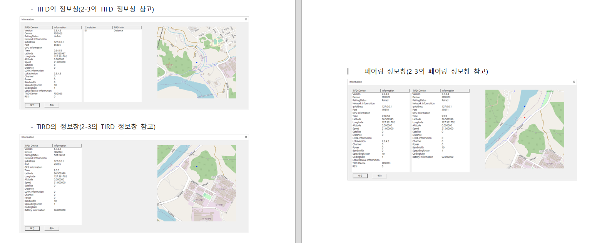
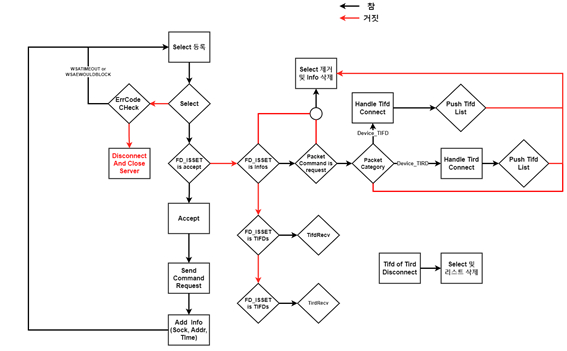
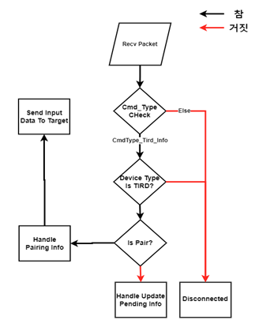
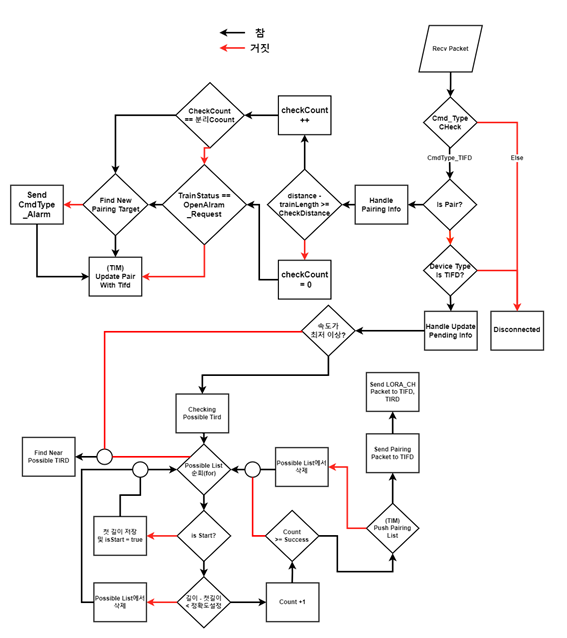

# 환경소개
- OS : windows10
- Language : C++ 20, python, WINAPI

- Python version : 3.8.6
- Need Libs : staticmap, pillow, request

- ※ PythonSetup 배치 파일 실행시, 관리자 권한으로 실행시켜야 함.
- ※ 배치파일 실행하게 되면, C:\Python38 폴더 생성 및 환경 변수 저장까지 완료

# 기능 설명
- TIM 서버는 PC 원도우 환경에서 TIFD와 TIRD 간에 초기 무선접속, IP 기반 페어링과 데이터 로그 기능을 제공하기 위한 요구사항과 기능 설계. 그리고 시험 검증을 설명한다.
- 본 프로그램은 사전에 공유가 허락되어 있음을 알려드립니다.
- 본 코드의 TIFD, TIRD 폴더의 코드는 테스트 코드입니다.

### 메인 화면


### 정보창 출력


# 사용 방법
1. 파이썬 3.8버전과 라이브러리가 전부 설치되어 있지 않은 경우에는 PythonSetup.Bat 파일을 관리자 권한으로 실행시킨다.
2. config.json에 있는 “ServerIP”를 변경하여 사용하고자 하는 고정 IP를 설정한다.
3. config.json에 있는 “LogPos”를 변경하여 로그 저장 위치를 설정한다.
4. TIM.exe를 실행시킨다.
5. 시작 버튼을 누르게 되면 서버가 구동된다.
7. 종료를 누르면 모든 연결이 종료되며 프로그램이 종료된다.

# 코드 리팩토링 과정
- 본 프로그램은 QT 라이브러리로 제작된 윈도우 버전 프로그램 이하 윈도우 프로그램
- C언어로 제작된 리눅스 버전 프로그램 이하 리눅스 프로그램
- 두 프로그램을 분석하여 리팩토링한 프로그램임을 알려드립니다.

### 1. 코드 분석 과정
1. 두 프로그램 모두 TCP/IP 통신을 사용하기에, 통신에 사용되는 패킷 규약이 존재할 것이라 가정
2. 분석을 통해 패킷 규약을 찾아내었습니다.
[패킷 형태](docs/패킷 형태 정리.pptx)
3. 윈도우 프로그램을 분석하여 패킷에 따른 동작 형태를 분석
4. 리눅스 프로그램을 분석하여 네트우크의 동작 형태를 분석
5. 이 과정에서 이상하게 동작하는 부분은 박사님과의 회의를 통해 결정

### 2. 프로그램 제작 과정
1. 먼저 리눅스 프로그램을 통해 분석한 내용으로 네트워크 형태를 구현
2. 이후 윈도우 프로그램을 통해 분석한 내용으로 패킷에 다른 동작 구현
3. 문제 발생
	- 리눅스 버전의 경우, 기기가 접속할 때 마다 스레드를 생성하였는데
	- 특정 개수(CPU의 코어에 따른 적정 스레드 수)가 넘는 순간 느려지는 현상
	- 데드락 발생
4. 아래 문제 해결 과정을 통해 해결
5. GUI 동작과 네트워크 동작 분리
	- GUI 동작은 메인 스레드에서 담당하고
	- 네트워크 코드는 네트워크 스레드로 분리
	- 동작 실행은 JobQueue로 실행

6. 이후 계속해서 박사님께서 추가 요청하신 기능 구현
7. 테스트
8. 6~7번 반복

# 문제 해결
## 데드락
- 코드 리팩토링 과정 2.3에서 발생한 추가적인 문제
- GUI 상에서 정보창을 출력하려고 하면 데드락으로 인한 무한 로딩이 걸림
- 아래는 문제 발생 직후 해결 과정


1. [DeadLock Save](TIM/DeadLock.h) 클래스를 만들어 Lock을 사용할 때 마다 로그를 저장
2. 해당 로그를 분석하여 예상 지점들 발견
3. 예상 지점의 락을 해제해보며 발생하는지 확인 -> 데드락 지점 발견
4. atomic을 Lock 대신 사용 -> 비트 연산으로 사용하면 ID과 1을 추가. 끌때는 0으로 변경
```
// 사용
int32 isInfo = id << 4;
if (IsInfo.compare_exchange_weak(isInfo, isInfo + 1))
{
    string tirdDeviceId = data.nTirdRcvId;
    TifdInfoUpdate(isInfo, pair{ data.lat, data.lon }, StringToWstring(tirdDeviceId), possibleList, ptr);
}

// 종료
IsInfo.store(infoId);
```

## 스레드 문제
- 리눅스 버전의 문제였던 스레드 과다 생성 문제
- 코어 부분의 리눅스 호환성을 생각하여 Select 모델로 단일 스레드화

## 지도 출력
- GPS 정보를 토대로 지도 정보를 받아와 GUI 상에 출력하여야 했음.
- Staticmap 라이브러리로 지도 정보를 받아와 렌더링하여 PNG로 저장
- 이후 저장된 PNG를 WINAPI GUI 상에 띄우는 형식으로 진행

- Python 라이브러리를 포함하여, C++ 상에 [CreateMap.py](TIM/CreateMap.py)를 적재함.
- 이후 클래스로 만들어서 호출하여 사용할 수 있도록 만듬.

- 문제점 : 함수를 호출하면, PNG가 생성되는 시간이 고정적이지 않음
- HTML 파일로 받아오는 시간은 일정하게 빠르나 PNG로 렌더링하는 속도가 제각각임

# 코드 설명

### Accept Code
- [TIMServer.h](TIM/TIMServer.h) : 네트워크 통신이 구현되어 있는 클래스로, 연결 및 종료, 패킷 동작 등을 수행합니다.



### TIRD Flow Chart
- [TirdSession.h](TIM/TirdSession.h) : TIRD 기기를 나타내는 클래스로, TIRD 기기가 접속하면 생성되는 객체입니다.



### TIFD Flow Chart
- [TifdSession.h](TIM/TifdSession.h) : TIFD 기기를 나타내는 클래스로, TIFD 기기가 접속하면 생성되는 객체입니다.



### GUI
- [WinApi.h](TIM/WinApi.h) : WINAPI를 사용하여 GUI를 나타내는 클래스이다. 정보는 [TIMServer.h](TIM/TIMServer.h) 에서 넘겨받아 [JobQueue.h](TIM/JobQueue.h) 방식으로 실행됩니다.
- [PythonMap.h](TIM/PythonMap.h) : Python 프로그램을 적제하여 실행할 수 있도록 하는 클래스입니다.
- [CreateMap.py](TIM/CreateMap.py) : Python 프로그램으로 [PythonMap.h](TIM/PythonMap.h)에 적재할 함수가 들어가 있습니다.


### Utils
- [JsonParser.h](TIM/JsonParser.h) : 간단하게 제작한 JsonParser 클래스로, 처음 설정 정보를 가져올 때 사용합니다.
- [FileUtils.h](TIM/FileUtils.h) : 로그 저장을 간편하게 하기 위해 제작한 유틸 클래스입니다.
- [Utils.h](TIM/Utils.h) : 필요한 유틸 기능 함수들이 들어가있는 파일입니다.


### 자료형
- [Packet.h](TIM/Packet.h) : 패킷 형태가 들어가있습니다.
- [Enums.h](TIM/Enums.h) : Enum 형태들이 들어가있습니다.
- [config.json](TIM/config.json) : 초기 설정값이 들어가 있습니다.


